# [github/chrislaney](https://github.com/chrislaney)
# [chrislaney.net](https://chrislaney.net)

This portfolio portion of my github was made to display my work in CS 5124 - VISUAL INTERFACES DATA at University of Cincinnati

# Project 3; TV Show

### Project Topic and Motivation:

Our team chose the TV show SpongeBob SquarePants which first aired on Nickelodeon in 1999 and is still releasing new episodes today. We made this decision mainly due to multiple team members having enjoyed the show while growing up, the cultural impact of this show on many people as well as the series including many memorable recurring characters. These characters interact in many settings and engage in unique exchanges of dialogue which makes for some very interesting visualization potential.

### Data Collection and Processing:

The data for this project was collected in two different ways. The first was the collection of the transcripts for each individual episode and the second was collecting the list of episodes for each season. This was done simply due to what data was available online.

Episode Transcripts: https://www.kaggle.com/datasets/mikhailgaerlan/spongebob-squarepants-completed-transcripts?resource=download
 
Sample Episode List: https://thetvdb.com/series/spongebob-squarepants/seasons/official/1

The list of episodes from each season was scraped from the website listed above by using the IMPORTHTML function in google sheets. These imported lists were then compiled into a single master csv file which listed all of the episodes with their season, episode number, title and airdate. This csv was used to match against the episode transcript files and then create the final csv data files with all the needed information.

This process was accomplished with a short python script which read in all of the transcript files obtained from the link above and processed them into a csv format. Using all of this information the following csv header list was arrived at:

Id, speaker, speech, context, raw-dialouge, season, episode, title, airdate, runtime

Each line of dialogue has a unique id for various purposes. The python script identified the speaker of the dialogue, what words that speaker said and then also any context clues that were included in that line. The transcripts often included bracketed context clues within the speech which indicated things like the speakers emotions or actions in the scene. These were separated for easier access in the script. The other csv headers are self-explanatory and were pulled from the complete episode list file that was created by web scraping. The main functions of the python script can be seen below:

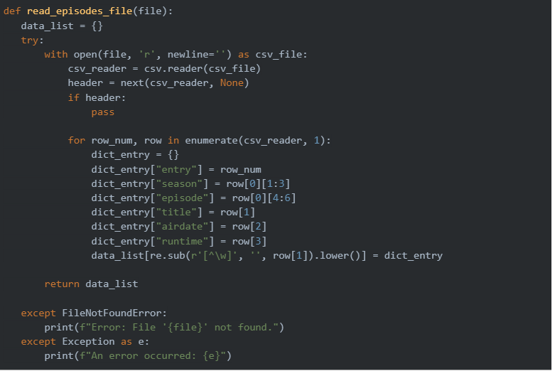

The above method creates a usable list of all the episodes so that this information can be matched and extracted in the next step.

The above method will read in the episodes dictionary that was just created and then loop through each episode transcript file. If an episode name is matched then that episode data is used to write the csv. The speaker, speech and context are parsed from the transcript for each line and then added to a list of data to be written. Both a complete csv with every episode’s data and individual season csv files are written with this script.

### Visualization Components and Layout:

Initial Sketch -

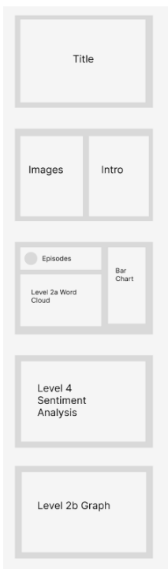

Our visualizations start off with our title page, we wanted to have a strong theme tied to the show:

Next we wanted to include a page which would introduce our audience to the data being used. If someone was unfamiliar with the show it would be important for them to have some context and look through the important characters:

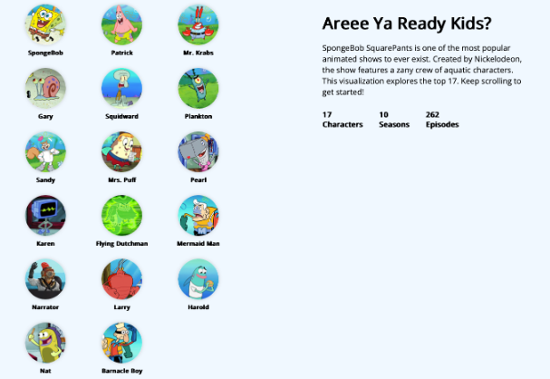

The purpose of our first visualization is to allow a user to explore line metrics for each of the characters. We wanted to allow someone to select a character and see how many lines were spoken by the character across the different episodes and seasons. A user can hover on an episode so that they can see the title and the number of lines spoken:

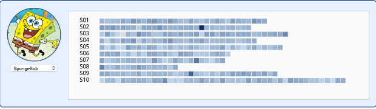

As an additional view for this character selection, we wanted to show some broader metrics for all the characters in comparison to the selected character. In this bar graph, one can see the selected character highlighted and compare their total lines spoken to the lines spoken of the other characters. If the user is not interested in the lines spoken metric, they could also choose to see the number of episodes appeared in or words spoken metrics using the drop down menu:

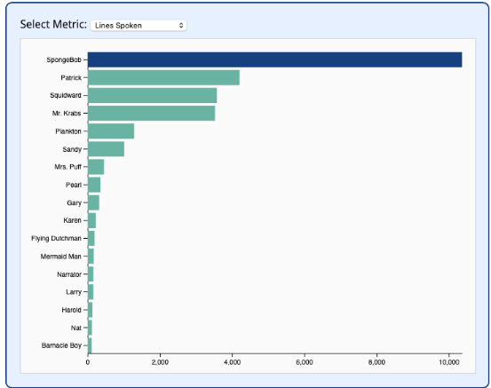

Next we wanted to create a nice visualization to see the most common words spoken by the selected character. We went with a word cloud for this and the visualization will change so that it also reflects the chosen character. Common words were filtered out:

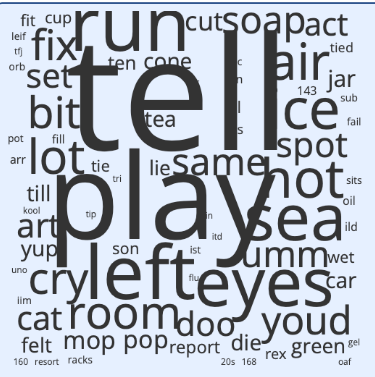

We also wanted to include a plot of all the characters spoken lines against the number of episodes that they appeared in. This is to show how relevant certain characters are to the show compared to others:

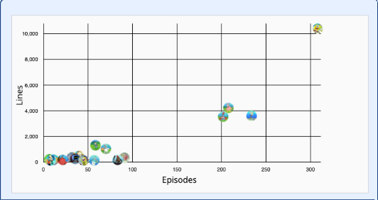

For a special visualization we thought it would be interesting to see the calculated sentiment of the lines spoken between the characters of the show and the main character SpongeBob. We used some sentiment analysis and machine learning tools to create these sentiment findings and then plotted the characters sentiments:

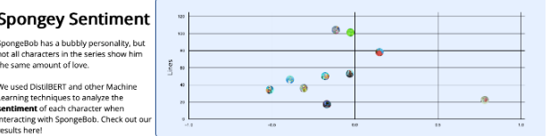

Throughout our visualizations we wanted to make the views large enough and in a meaningful arrangement. Because of this we chose to make our application span multiple pages instead of trying to get everything onto a single dashboard. This way we could introduce the data and then walk a user through the visualizations for each character. We also chose to stay on theme with the ocean and made the color theming and color gradients all shades of blue and light green.

Finally, we created a visualization for showing the interactions between characters in the show on a per episode basis. The connections between characters are weighted by the number of interactions and a tooltip can be displayed when hovering the connections to show this number:

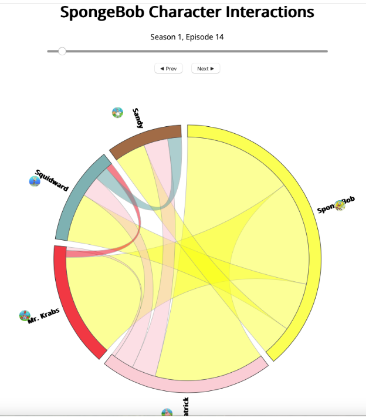

Process:

Project Code Repo: https://github.com/chendrix99/DataVisProject3

Hosted Site: https://chendrix99.github.io/DataVisProject3/

Our project can be accessed from the above link to the hosted GitHub pages version or the code can be cloned and then built locally in VS Code.

For the data processing we used simple libraries like python’s csv, os and re libraries for cleaning the data and writing to the csv files. For the sentiment analysis processing the python libraries DistilBERT were used for analysis. 

The code was structured similarly to previous projects with a separate data, js, and css folders and a main index.html at the root.

Demo:

[@Screen Recording 2025-04-25 at 3.26.01 PM.mov](https://drive.google.com/file/d/1XAmQcyNKxFwjpjOs6fyyTTddvshjs-gV/view?usp=sharing)
Contributions:

Chris Laney - Implementation of level 3 goals including the network visualization.

Yale Miller - Implementation of level 1 goals and also initial design sketches.

Prabh Singh - Implementation of level 2 goals including the word cloud visualization.

Jake Huseman - Implementation of level 4 goals including the sentiment analysis visualization.

Caleb Hendrix - Data collection and preprocessing as well as the documentation requirements.

# Vis in the wild assignment -- EARTHQUAKE PROJECT BELOW THIS.

[Music Map Site Here](https://musicmap.info/)

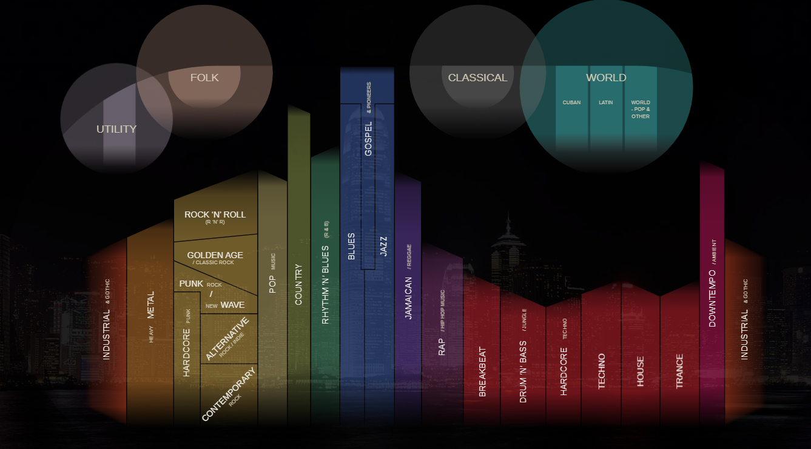
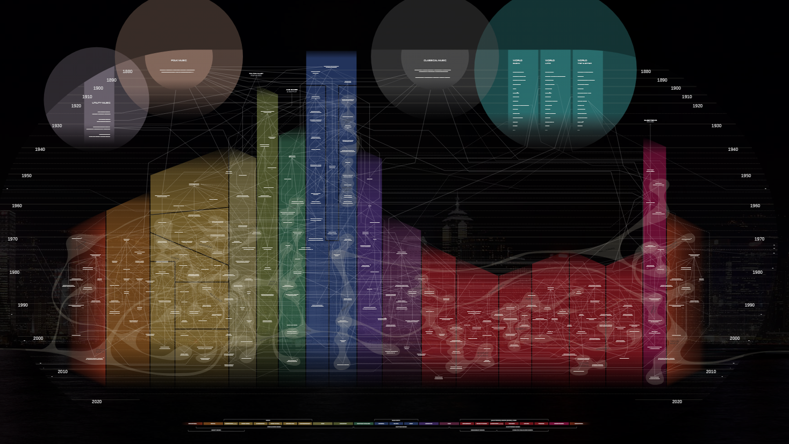

This is a website shows a genealogical map of many subgenres along with their parent and child genres ie genre influences, think rock to punk rock to grunge rock. Along with time period, and lines connecting to where they get influences from. The data that was used for this was done in a research like method, more qualitative than quantitative and it is mainly the names of many subgenres and then on a graph, how they connect to other genres and what super genre they fall into. The users of something like this would be anyone that is interested in music! Which is super nice, I think most people can find their niche or taste in here, and from there branch out and explore other genres they might find interesting, in a non algorithmic spotify type of way. The goals of this, as stated by the website were to inform anyone regardless of race, age education about the basics of music. To inspire people to explore the world of music. To improve the existing music genre database. To motivate the use of genres while discouraging pigeonholing. Reduce discrimination and prejudice based on genre.

Use of the website; For finding a genre and then finding what genres influence that genre. Click on a genre, then you receive all the influences and parent genres from it, and can explore from there. There are these white swaths encompassing some genres within the super genre, and I would almost call those a “family” where anything in a swath is very related, not necessarily influential of each other but certainly related. 

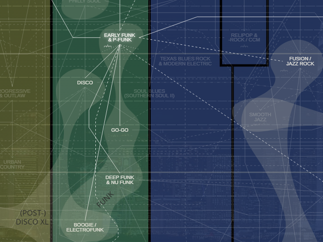
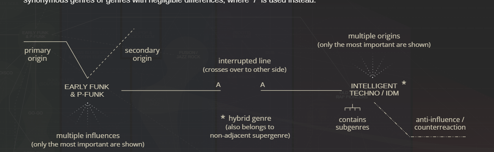

The visual interactions are really good and the site is smooth. I would say it is really crowded, especially with all the lines there is a lot to parse through and its easy to get lost. However I think when you are dealing with this sort of data and also as many features as they have its sort of unavoidable but I think they do it really well. Not to mention it is very fast and responsive so that makes up for getting lost in it. 

One limitation is that it is hard to see where geographically these trends emerged. I wish they did a better job of that. Obviously there would need to be a completely different map for that because its so difficult but it would be cool to see over time where these trends and genres emerged. 

# Earthquakes Around The Globe

## 1. Data
The data we used for this project is sourced from the US Geological Survey (accessible here), and we are currently using data from 2014 to 2025. Each datum represents a recorded seismic event, complete with its longitude/latitude, time, magnitude, depth, and a variety of other identifying information. In our visualization, we highlight the magnitude and depth for analysis, and use the coordinates and time to narrow down the user’s area of focus.
2. Visualization Components

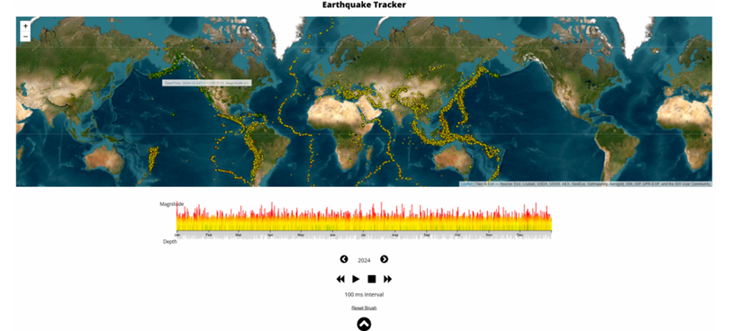
Fig 1. Default view from our completed project.

## 2.1. Map

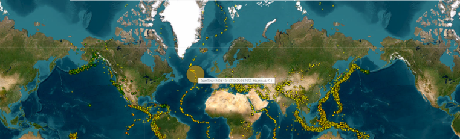
Fig 2. Map component from our completed project.

The map component displays a significant amount of the data with each “dot” representing a specific seismic event. We’ll discuss the timeline next (which sits beneath the map in our GUI), but it’s important to mention that the two components are directly interrelated, and each dot in the map corresponds to a bar in the timeline bar graph. For additional information on a particular datum, the user can hover with the mouse and a tooltip will show the exact date, time, and magnitude.

This component is created using the leaflet library (accessible here). This library is used to create dynamic and interactive maps in Javascript.

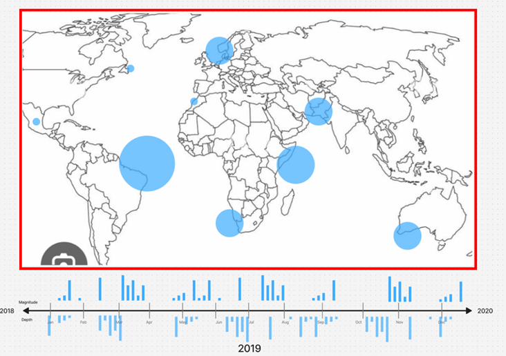
Fig 3. Initial sketch of the map and timeline (map highlighted in red).

From our initial sketch, we were fairly certain how we wanted the final product to look and behave, with a banner-like map seated above an interactive timeline that could be used to focus particular sets of data for inspection.

## 2.2. Timeline and Timeline Controls

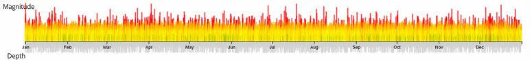
Fig 4. Timeline component from our completed project.

The timeline is a double bar chart used to display both magnitude and depth information over a particular timespan. As mentioned before, each bar in the bar graph corresponds to a point in the map component above. When combined with the timeline controls and ability to focus different timespans, this allows users to explore the data more freely, and without too much visual clutter.

For example, the user can select a certain “region” in the timeline to focus that timespan:

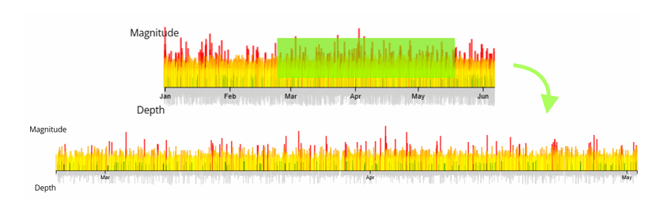
Fig 5. User selects a region from roughly March to May, and the timeline is updated accordingly.

Additionally, to support level 5 requirements, we have added a “timeline controls” panel beneath the timeline that allows for the selected timespan to be “animated,” showing each recorded datum one after another at a set speed. The controls panel can also be used to change the year that’s being shown, and due to the data we downloaded the years 2014-2025 are accessible.

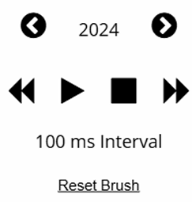
Fig 6. Timeline controls component from our completed project.

Again, we determined the purpose of the timeline double bar graph early on in development, and this can be seen in our sketch (see Fig. 7). The idea to have depth shown on the bottom and magnitude on the top was our initial design, and we enhanced this with the control panel during development to add more functionality and usability.

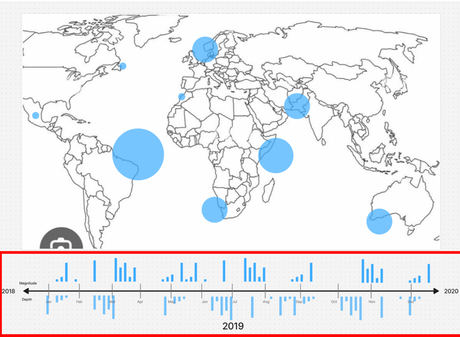
Fig 7. Initial sketch of the map and timeline (timeline highlighted in red).

## 2.3. Data Manager and Options

The next component enhances a lot of existing functionality and gives the user more control over what information is currently displayed on the map and timeline. We call this component the “Data Manager,” and it can be enabled by clicking a button in the bottom-center of the GUI.

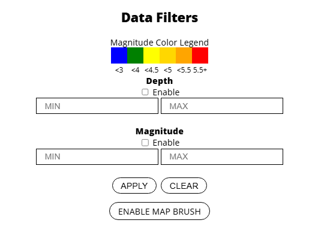
Fig 8. Data manager component from our completed project.

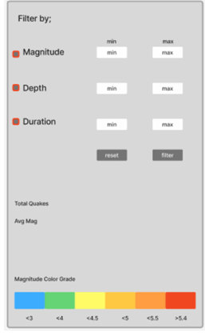
Fig 9. Initial mockup of data manager component.

From top to bottom (in Figure 8), the data manager supports a number of important features for this project: (1) the depth, magnitude, and duration filters can be used to filter out seismic event data, (2) the apply and clear buttons allow the user to commit or undo their changes, (3) and the “enable map brush” allows the user to select regions in the map for manual inspection (similar to how the brush that can be used in the timeline component).

From this menu, the user can also modify the map settings. This currently allows for different map backgrounds to be selected:

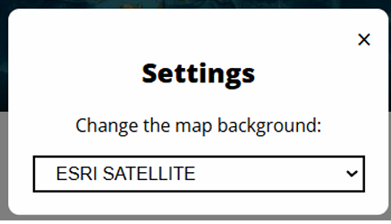
Fig 10. Map settings component from our completed project.

With the aforementioned components, our project succeeds in addressing levels 1 through 5 for this project, and gives users the ability to freely explore the USGS earthquake data with a variety of different tools, settings, and visualizations.

## 3. Discovery

A great visualization tool isn’t “great” unless it allows you to uncover something interesting or valuable from the data it displays. During and after implementation, we made several compelling discoveries with our visualization. 

Firstly, after completing the map, we were struck by how well-defined the fault lines are. In hindsight, this might be obvious, but the lines are extremely visible and clear when looking at the data from an aerial map perspective. Another interesting discovery was the extreme concentration of medium-to-high-magnitude earthquakes beneath Japan. In popular culture, this area is known for having a large number of earthquakes, but seeing it visually gives a whole different understanding to the phenomenon. After some brief research, we discovered that this was due to Japan resting atop the meeting point of four different tectonic plates, which can be observed in our visualization as well.
## 4. Technical Details & Process

Resources Used
USGS Earthquake Data: As mentioned before, we used the USGS earthquake data for our project.
D3: We used the D3 JS library to create in-depth visualizations, such as the timeline double bar graph.
Leaflet: We used the Leaflet JS library to create our dynamic and interactive map.
HTML, CSS, JS: Otherwise, our project is constructed using a default front-end web stack, including CSS for styling, HTML for structure, and JS for general scripting.

## Code Structure / Technical Architecture
The code is structured as so; Index.html controls the actual architecture and layout of the page as you might imagine. Main.js is the bridge from our javascript and D3 to the Index. Main Handles all the filtering functions, button clicks, any event triggers, it redraws the map and timeline upon these event triggers. It is the control hub. Timeline.js handles everything relating to the timeline, which includes the line itself, the bar graphs for depth and magnitude etc. LeafletMap.js handles all things relating to the map such as the circle sizes and tool tips. The filter is done via main (in retrospect I would change this) but it handles most of the event triggers, button clicks, filter value changes, etc. 

Links
GitHub repository for our code: chendrix99/DataVisProject2 
Live-hosted link for our visualization tool: 
## 5. Demo

[DEMO LINK HERE](https://drive.google.com/file/d/11dLqxikrqQx6F2wFKbQyonrDbSLCTrkE/view?usp=sharing)

## 6. Team Breakdown

### Caleb Hendrix;
Worked on initial design sketches
Worked on Level 1, 2, 4 goals
### Jake Huseman;
Worked on initial design sketches
Completed documentation and demo
### Yale Miller;
Implemented tool tips and other visual features
Worked on Level 6 goals
### Prabhjot Singh;
Styling overhaul
Worked on Level 5 goals
### Chris Laney;
Worked on initial design sketches
Worked on Level 1, 2, 3 goals

--

# Data in the USA; Household Income's Relationship w/ Stroke and Heart Disease

The motivation for this application was to help users better understand how income may affect and cause the morbidities of stroke, coronary heart disease, high blood pressure, and high cholesterol. Some of these are highly correlated and others less so. The units we are analyzing are counties in the United States, and the percents of their population that suffer from stroke coronary heart disease, high blood pressure, and high cholesterol. The data that is being visualized was collected by the CDC and is from 2024. It can be found [here](https://www.cdc.gov/heart-disease-stroke-atlas/about/?CDC_AAref_Val=https://www.cdc.gov/dhdsp/maps/atlas/index.htm)

## Design Sketching and Data Selection

These were my original design sketches after reading the requirements briefly, As I started to build my first plot (the scatter) I changed the way I wanted things to look and sort of planned around there being some interactivity. 

I think its worth it to note that during the selection process of what data I used I relied heavily on descriptive statistics and a correlation heatmap of which attributes were heavily correlated. This allowed me to actually pick some attributes that could tell a story.

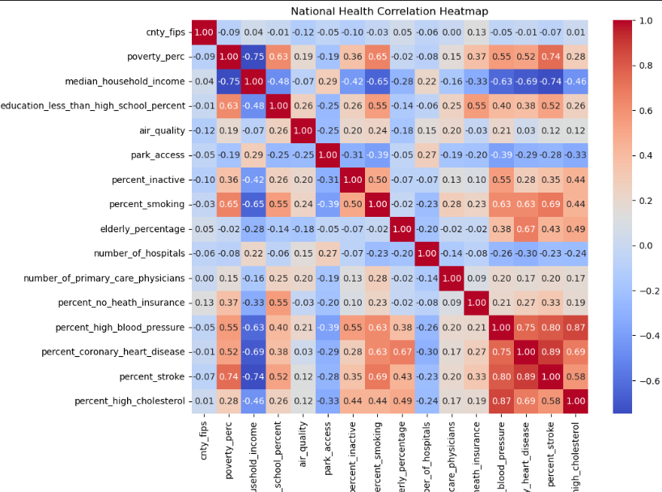

I settled on income and the group of morbidities listed because there was a large correlation there and thought it might be more interesting to explore vs something with no correlation. I originally wanted to do how park access affects those morbities but there was not enough correlation for my liking. 

## User Interface Design

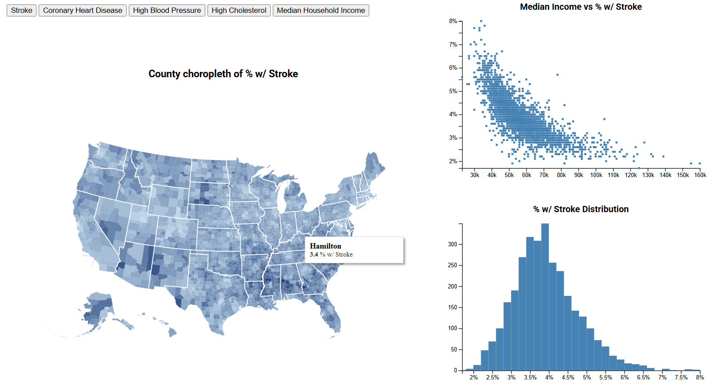

The user interface is very simple and straightforward. There are 5 buttons at the top used to toggle between views of the different morbidities and then also median household income. Upon selecting a button the graphs will be redrawn with whatever morbidity a user selects.

### Scatter Plot 
The top right contains a scatter plot with a static x axis of median income, and then the y axis varys with whatever morbidity is currently selected. The graph also has a tool tip capability where upon hover of a point it will show the County name, median income level, and morbidity percentage. 

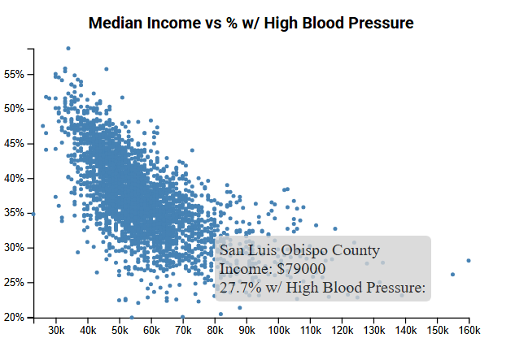

### Bar Chart
The bottom right contains a bar chart, this is used to give distributions of a single attribute and see where the most counties lie

### Choropleth Map;
The left side contains the choropleth which shows state and county borders. They are shaded on a scale where the ligher color represents a lower value and the darker value represents a higher value. Looking back now I forgot to add a legend which makes it sort of hard to understand. Nonetheless this changes based on which attribute is selected in accordance with the other two graphs. It also has a tool tip capability that lists county name and attribute value. 

## Findings
All of the morbidities listed have some sort of negative correlation with income, with stroke being the strongest, and high cholesterol being the weakest. Stroke and high blood pressure are highest in the deep south which also happens to be where household income is the lowest. When average household income rises above about 60k there appears to be a large plateau, the curve is sharpest in the 30k-60k region for stroke, coronary heart disease, and high blood pressure. The entirety of the US appears to have too high of cholesterol and it seemingly knows no fiscal bounds. 

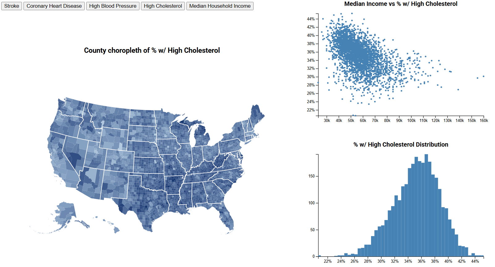

## Process

I used the d3 library along with the choropleth topojsonv3 and the counties-10m.json for county boundaries. For data selection and parsing I used python. The code is set up modularly with an index.html and a main.js. All charts are broken off into their own js files and then a drawChart() function is called from main. It can be ran simply by live deploying the index.html

live site is currently host for free via netlify [here](https://splendid-chimera-348df4.netlify.app/)

the github repo is [here](https://github.com/chrislaney/USAHealthDataViz)

## Challanges and Future Works

The choropleth provided a decent amount of challange, along with the just the normal challanges encountered with finnicky ui elements. 

An addition I wanted to add was a general data window over on the right side of the page that a user would be able to search by state, search by county or if they selected via brush, all their data points would appear in the window. These would be coordinated with the plots as well. 

Also in hindsight the unstyled buttons make the project look really janky.

There were also some less than optimal solutions taken while coding this, such as redrawing the plots every time on button click and having each chart calculate the extents of the data every time and whatnot.

## AI, Collab, Demo
Yes I used chatgpt in this project, it was especially helpful for navigating the d3 documentation. Shoutout my classmate Nate for solving the weird polygons on the choropleth with the solution of setting stateborders fill to none. 

[DEMO LINK HERE](https://mailuc-my.sharepoint.com/personal/laneyct_mail_uc_edu/_layouts/15/embed.aspx?UniqueId=b7ff3f1e-9e01-4c36-a0a5-2c8c621a5931&embed=%7B%22ust%22%3Atrue%2C%22hv%22%3A%22CopyEmbedCode%22%7D&referrer=StreamWebApp&referrerScenario=EmbedDialog.Create)

If the link does not work, please see that the mp4 for the demo is included in the githubio directory [here](https://github.com/chrislaney/chrislaney.github.io/blob/main/Data%20Viz%20Demo%20Recording-20250227_211921-Meeting%20Recording.mp4) and is available to download.

