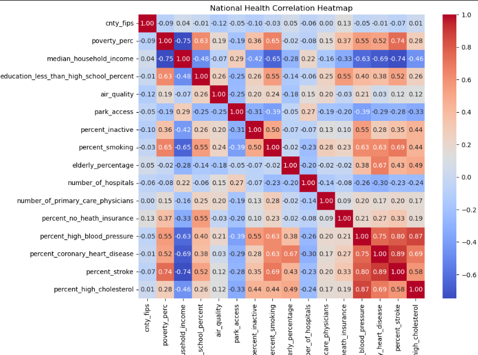
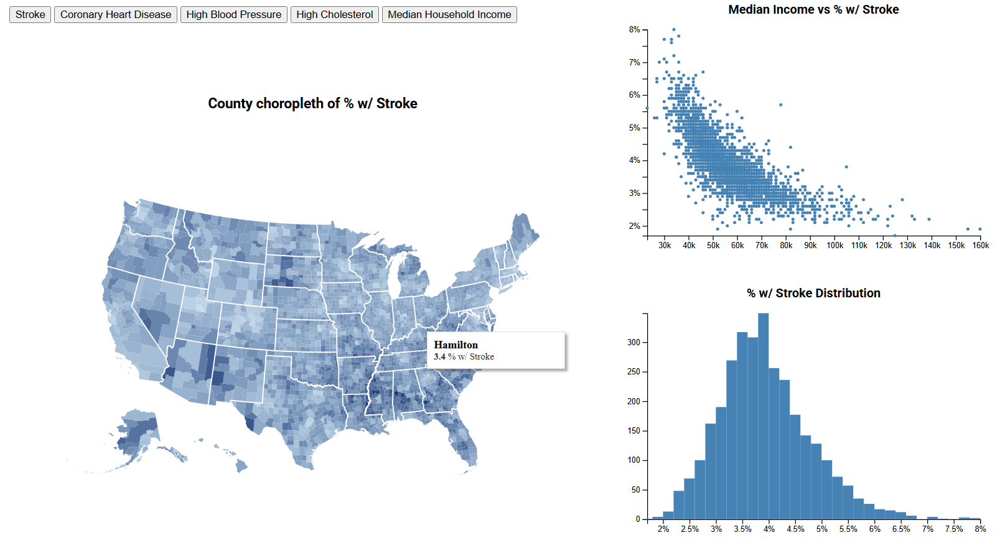
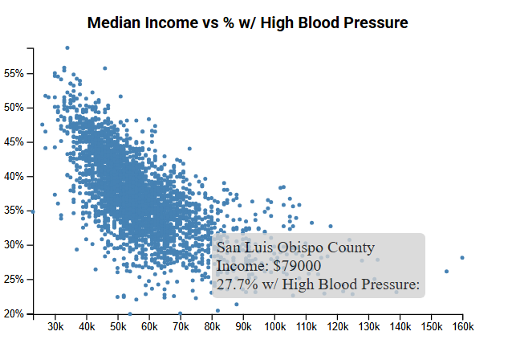
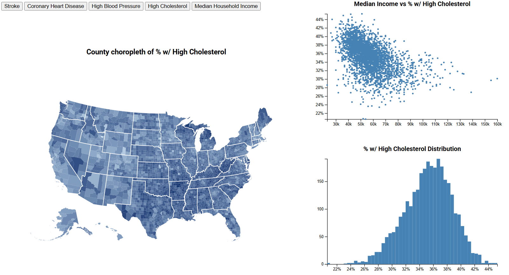

# [github/chrislaney](https://github.com/chrislaney)
# [chrislaney.net](https://chrislaney.net)

This portfolio portion of my github was made to display my work in CS 5124 - VISUAL INTERFACES DATA at University of Cincinnati
--

# Data in the USA; Household Income's Relationship w/ Stroke and Heart Disease

The motivation for this application was to help users better understand how income may affect and cause the morbidities of stroke, coronary heart disease, high blood pressure, and high cholesterol. Some of these are highly correlated and others less so. The units we are analyzing are counties in the United States, and the percents of their population that suffer from stroke coronary heart disease, high blood pressure, and high cholesterol. The data that is being visualized was collected by the CDC and is from 2024. It can be found [here](https://www.cdc.gov/heart-disease-stroke-atlas/about/?CDC_AAref_Val=https://www.cdc.gov/dhdsp/maps/atlas/index.htm)

## Design Sketching and Data Selection

These were my original design sketches after reading the requirements briefly, As I started to build my first plot (the scatter) I changed the way I wanted things to look and sort of planned around there being some interactivity. 

I think its worth it to note that during the selection process of what data I used I relied heavily on descriptive statistics and a correlation heatmap of which attributes were heavily correlated. This allowed me to actually pick some attributes that could tell a story.

I settled on income and the group of morbidities listed because there was a large correlation there and thought it might be more interesting to explore vs something with no correlation. I originally wanted to do how park access affects those morbities but there was not enough correlation for my liking. 

## User Interface Design

The user interface is very simple and straightforward. There are 5 buttons at the top used to toggle between views of the different morbidities and then also median household income. Upon selecting a button the graphs will be redrawn with whatever morbidity a user selects.

### Scatter Plot 
The top right contains a scatter plot with a static x axis of median income, and then the y axis varys with whatever morbidity is currently selected. The graph also has a tool tip capability where upon hover of a point it will show the County name, median income level, and morbidity percentage. 

### Bar Chart
The bottom right contains a bar chart, this is used to give distributions of a single attribute and see where the most counties lie

### Choropleth Map;
The left side contains the choropleth which shows state and county borders. They are shaded on a scale where the ligher color represents a lower value and the darker value represents a higher value. Looking back now I forgot to add a legend which makes it sort of hard to understand. Nonetheless this changes based on which attribute is selected in accordance with the other two graphs. It also has a tool tip capability that lists county name and attribute value. 

## Findings
All of the morbidities listed have some sort of negative correlation with income, with stroke being the strongest, and high cholesterol being the weakest. Stroke and high blood pressure are highest in the deep south which also happens to be where household income is the lowest. When average household income rises above about 60k there appears to be a large plateau, the curve is sharpest in the 30k-60k region for stroke, coronary heart disease, and high blood pressure. The entirety of the US appears to have too high of cholesterol and it seemingly knows no fiscal bounds. 

## Process

I used the d3 library along with the choropleth topojsonv3 and the counties-10m.json for county boundaries. For data selection and parsing I used python. The code is set up modularly with an index.html and a main.js. All charts are broken off into their own js files and then a drawChart() function is called from main. It can be ran simply by live deploying the index.html

live site is currently host for free via netlify [here](https://splendid-chimera-348df4.netlify.app/)

the github repo is [here](https://github.com/chrislaney/USAHealthDataViz)

## Challanges and Future Works

The choropleth provided a decent amount of challange, along with the just the normal challanges encountered with finnicky ui elements. 

An addition I wanted to add was a general data window over on the right side of the page that a user would be able to search by state, search by county or if they selected via brush, all their data points would appear in the window. These would be coordinated with the plots as well. 

Also in hindsight the unstyled buttons make the project look really janky.

There were also some less than optimal solutions taken while coding this, such as redrawing the plots every time on button click and having each chart calculate the extents of the data every time and whatnot.

## AI, Collab, Demo
Yes I used chatgpt in this project, it was especially helpful for navigating the d3 documentation. Shoutout my classmate Nate for solving the weird polygons on the choropleth with the solution of setting stateborders fill to none. 

